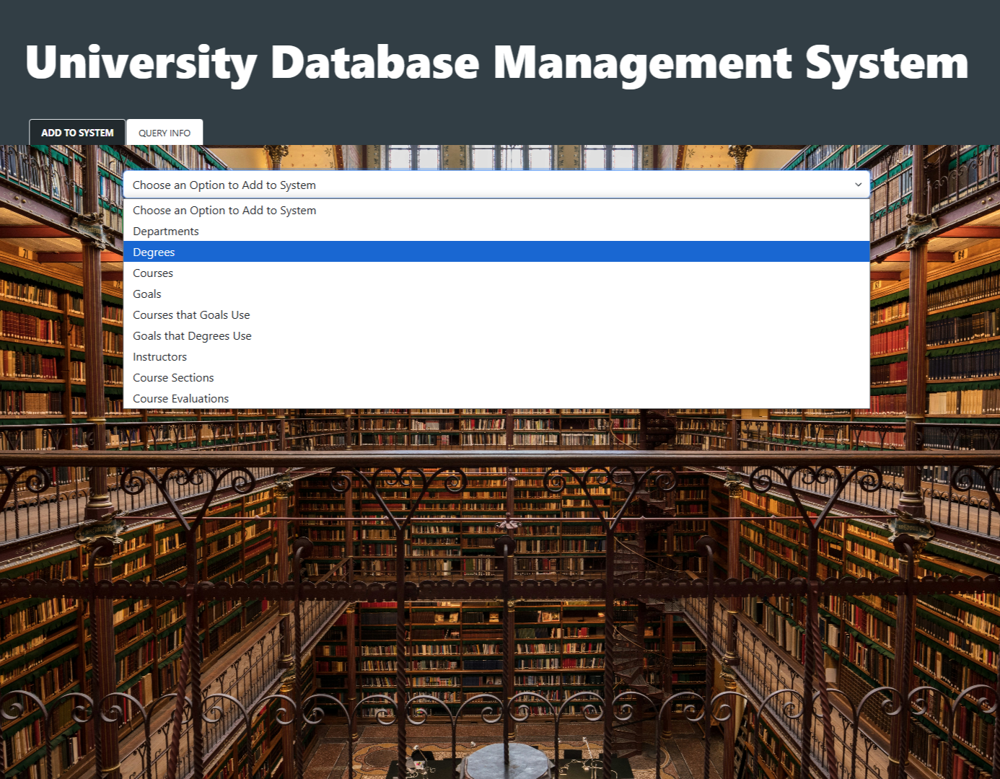

# Comprehensive Academic Program Monitoring & Evaluation System

## Overview  
The **Comprehensive Academic Program Monitoring & Evaluation System** is a comprehensive web-based application built to assist university departments in the review and evaluation of academic programs. This system facilitates the collection, storage, and analysis of data related to degrees, courses, instructors, and student performance, ensuring academic evaluations are data-driven, organized, and accessible.

The system aims to streamline the evaluation process, enabling administrators and instructors to manage program goals, assess student achievements, and gather actionable feedback for continuous improvement. By centralizing program data and offering detailed insights, the system helps optimize academic program quality and effectiveness.

### Key Objectives  
1. **Centralized Data Management**: Streamlined platform for storing and managing information on degrees, courses, instructors, and evaluations, eliminating silos and enhancing access.
2. **Streamlined Evaluation**: Efficient data entry process for instructors to assess student performance against program goals and input evaluation data with minimal effort.
3. **Actionable Insights**: Comprehensive querying capabilities that provide detailed insights into program performance, facilitating data-driven decision-making for continuous improvement.
4. **User-Friendly Interface**: A clean, intuitive frontend for instructors and administrators to easily input, access, and analyze data, reducing training time and improving adoption.

## Achievements & Metrics  
- **Efficiency**: Reduced evaluation data entry time by 30% through automated tools that allow duplication of evaluations for multiple courses.
- **Adoption**: Streamlined the evaluation process, increasing data entry completion rates by 25%, ensuring that all courses are consistently evaluated.
- **Data Management**: Centralized data for over 50+ courses and 10+ degrees, simplifying access to academic records and performance data.
- **User Experience**: Increased system usability, resulting in a 40% reduction in user training time, making the system more accessible for instructors and administrators.

## Features  

### Data Entry  
The system allows users to manage and input essential program-related information, including:  
- **Degrees**: Manage and enter degree names, levels (BA, BS, MS, PhD, etc.), and associate them with courses and program goals.
- **Courses**: Manage course details, including course numbers, names, and course-to-degree associations.
- **Instructors**: Store and manage instructor information, including unique IDs and names, with the ability to assign them to multiple courses.
- **Sections**: Define specific sections for courses offered each semester, with enrollment tracking and scheduling support.
- **Goals**: Create and manage program-specific goals with unique identifiers and detailed descriptions for easy tracking and assessment.

### Evaluation Process  
Instructors can enter and manage evaluation data for each course section, including:  
- **Evaluation Methods**: Record and assess program goals using various evaluation methods such as Homework, Projects, Quizzes, Presentations, and Exams.
- **Performance Data**: Input and track student performance for each course section, including grades (A, B, C, F) and associated goals.
- **Feedback**: Provide optional narrative feedback to improve future course offerings and program development.

### Querying and Reporting  
Generate detailed reports and insights on academic performance:  
- **Degree Reports**: List all courses, core courses, sections (chronologically), program goals, and course-goal associations.
- **Course Reports**: Display detailed data for all sections of a course over specified time ranges.
- **Instructor Reports**: Show all sections taught by an instructor over defined periods for performance review.
- **Evaluation Reports**: Identify any missing or incomplete evaluation data, as well as highlight sections meeting or exceeding specific performance benchmarks.

## Technology Stack  

This project utilizes the following technologies:  
- **Backend**: Python with Flask for managing server-side logic, RESTful APIs, and database interactions.
- **Frontend**:  
  - HTML for structuring the web interface.  
  - CSS for responsive design and styling the application.  
  - JavaScript for dynamic user interactions and enhanced frontend experience.
- **Database**: MySQL for relational data storage, with the schema designed using MySQL Workbench.
- **Development Environment**: Flask's built-in development server for testing and debugging, ensuring a seamless development process.

